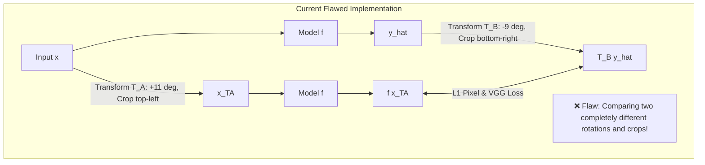
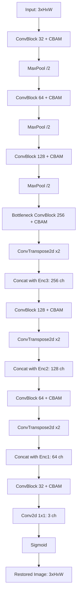

# Comprehensive Codebase & Research Audit Report
**Project:** Image Restoration with Perceptual Consistency Loss (`ImageRestoration-Consistency`)  
**Target Domain:** Low-Light Image Enhancement (LOL Dataset)  
**Date:** September 27, 2026  
**Audit Scope:** Model Architecture, Loss Formulations, Training & Validation Dynamics, Dataset Pipeline, Inference, Repository Hygiene, and Experimental Results.

---

## 1. Executive Summary

This repository implements a lightweight convolutional neural network ([UNetTiny](file:///d:/Projects/Research/ImageRestoration-Consistency/src/model.py#L69-L111)) enhanced with Convolutional Block Attention Modules ([CBAM](file:///d:/Projects/Research/ImageRestoration-Consistency/src/model.py#L7-L44)) for low-light image enhancement, trained with a composite objective combining $\mathcal{L}_1$ reconstruction, [LPIPS](file:///d:/Projects/Research/ImageRestoration-Consistency/src/losses.py#L10), multi-scale VGG feature consistency, Total Variation regularisation, and transformation consistency.

While the baseline achieves respectable numerical performance on the training runs (~20.66 dB peak PSNR, ~0.79 peak SSIM, ~0.222 best LPIPS), the codebase suffers from **three critical blockers** that compromise research validity, prevent training execution in the current git state, and corrupt the intended transformation-consistency objective:

```
┌────────────────────────────────────────────────────────────────────────────────────────┐
│                                   AUDIT SCORECARD                                      │
├─────────────────────────────────────┬──────────────┬───────────────────────────────────┤
│ Evaluation Category                 │ Rating       │ Primary Issue / Blocker           │
├─────────────────────────────────────┼──────────────┼───────────────────────────────────┤
│ 1. Runtime Integrity & Executability│ 🔴 CRITICAL  │ Crashes immediately on val assert │
│ 2. Consistency Loss Formulation     │ 🔴 CRITICAL  │ Disjoint random transforms applied│
│ 3. Loss & Regularization Fidelity   │ 🟠 HIGH RISK │ Fake color loss; LPIPS range error│
│ 4. Validation & Benchmarking Rigor  │ 🟠 HIGH RISK │ Random patch cropping on val set  │
│ 5. Model Architecture & Scalability │ 🟡 MODERATE  │ Fails on non-divisible dimensions │
│ 6. Inference & Testing Robustness   │ 🟡 MODERATE  │ No quantitative evaluation script │
│ 7. Repository Hygiene & Engineering │ 🟠 HIGH RISK │ .pyc & 1000+ raw images in Git    │
└─────────────────────────────────────┴──────────────┴───────────────────────────────────┘
```

> [!CAUTION]
> **Immediate Execution Blocker:** Calling `python src/train.py` on the current `main` branch will fail with `AssertionError: mismatch count` at [dataset.py:14](file:///d:/Projects/Research/ImageRestoration-Consistency/src/dataset.py#L14) due to an extraneous image (`low00690.png`) committed without a corresponding ground-truth pair.

> [!CAUTION]
> **Research Methodology Blocker:** The transformation consistency loss in [train.py:86-88](file:///d:/Projects/Research/ImageRestoration-Consistency/src/train.py#L86-L88) executes two independent random transforms ($T_A$ and $T_B$) rather than applying the identical transformation to input and output, actively penalizing correct geometric equivariance.

---

## 2. Critical Bugs & System Blockers

### Bug 1: Asymmetric & Disjoint Random Transforms in Consistency Loss Pipeline
* **Files:** [src/train.py#L86-L89](file:///d:/Projects/Research/ImageRestoration-Consistency/src/train.py#L86-L89), [src/transforms.py#L7-L34](file:///d:/Projects/Research/ImageRestoration-Consistency/src/transforms.py#L7-L34)
* **Severity:** 🔴 **Critical (Theoretical & Algorithmic Flaw)**

#### Description & Root Cause
Transformation consistency (or equivariance) asserts that enhancing a transformed degraded image should match the transformed enhancement of the original image:
$$f(T(x)) \approx T(f(x))$$

In [src/train.py](file:///d:/Projects/Research/ImageRestoration-Consistency/src/train.py#L86-L89), the training step executes:
```python
# Lines 86-88 in src/train.py
x_T = apply_transform_batch(x)
y_hat_T_pred = model(x_T)
y_hat_T_gt = apply_transform_batch(y_hat.detach())
```
In [src/transforms.py](file:///d:/Projects/Research/ImageRestoration-Consistency/src/transforms.py#L7-L34), `apply_transform_batch` samples random parameters on every invocation:
- Brightness gain: $\mathcal{U}(0.85, 1.15)$
- Rotation angle: $\mathcal{U}(-12^\circ, 12^\circ)$
- Resized crop: random bounding box scale $\mathcal{U}(0.85, 1.0)$ and ratio $\mathcal{U}(0.9, 1.1)$

Because `apply_transform_batch` is invoked twice independently, the first call samples transform $T_A = (\text{gain}_A, \theta_A, \text{crop}_A)$, while the second call samples a completely different transform $T_B = (\text{gain}_B, \theta_B, \text{crop}_B)$.



The loss function then penalizes:
$$\mathcal{L}_{\text{consistency}} = \| f(T_A(x)) - T_B(f(x)) \|_1$$
This forces the network to map an image rotated by $+11^\circ$ to match an image rotated by $-9^\circ$ at a completely different spatial crop. This corrupts network feature maps and destabilizes convergence.

#### Remediation
Sample transform parameters once per batch element, and apply the exact same transformation operator $T$ to both the input and the detached prediction:
```python
def apply_deterministic_transform(img, params):
    # Apply identical gain, angle, and crop using pre-sampled params
    ...
```

---

### Bug 2: Dataset Count Mismatch Causing Validation Crash
* **Files:** [src/dataset.py#L12-L14](file:///d:/Projects/Research/ImageRestoration-Consistency/src/dataset.py#L12-L14), [data/val/low/low00690.png](file:///d:/Projects/Research/ImageRestoration-Consistency/data/val/low/low00690.png)
* **Severity:** 🔴 **Critical (Fatal Crash)**

#### Description & Root Cause
In commit `dff09a4`, the file `data/val/low/low00690.png` was committed without an accompanying `data/val/high/` ground-truth image:
- `data/val/low/`: 16 images
- `data/val/high/`: 15 images

In [src/dataset.py#L14](file:///d:/Projects/Research/ImageRestoration-Consistency/src/dataset.py#L14):
```python
self.low_paths = sorted(glob(os.path.join(low_dir, '*')))
self.high_paths = sorted(glob(os.path.join(high_dir, '*')))
assert len(self.low_paths) == len(self.high_paths), "mismatch count"
```
Instantiating `val_ds` in `train.py` raises `AssertionError: mismatch count` immediately upon launch.

#### Remediation
Remove `data/val/low/low00690.png` or add its matching high-light counterpart, and refactor dataset pairing to match by file basenames rather than index length.

---

### Bug 3: Fragile File Pairing via Parallel Sorted Lists
* **Files:** [src/dataset.py#L12-L33](file:///d:/Projects/Research/ImageRestoration-Consistency/src/dataset.py#L12-L33)
* **Severity:** 🟠 **High Risk (Data Corruption)**

#### Description & Root Cause
The dataset class assumes that `sorted(glob(low_dir/*))` aligns 1-to-1 with `sorted(glob(high_dir/*))`. If a single filename differs in naming convention (e.g. prefix `low_` vs `high_` or an extra file), alphabetical sorting silently maps mismatched low-light and normal-light scenes across all subsequent indices. The model then trains on mismatched image pairs.

#### Remediation
```python
low_files = {os.path.splitext(os.path.basename(p))[0]: p for p in glob(os.path.join(low_dir, '*'))}
high_files = {os.path.splitext(os.path.basename(p))[0]: p for p in glob(os.path.join(high_dir, '*'))}
common_keys = sorted(set(low_files.keys()) & set(high_files.keys()))
self.pairs = [(low_files[k], high_files[k]) for k in common_keys]
```

---

### Bug 4: Random Crop on Validation Set Invalidating Evaluation
* **Files:** [src/dataset.py#L26-L28](file:///d:/Projects/Research/ImageRestoration-Consistency/src/dataset.py#L26-L28), [src/train.py#L50-L51](file:///d:/Projects/Research/ImageRestoration-Consistency/src/train.py#L50-L51)
* **Severity:** 🟠 **High Risk (Metric Validity)**

#### Description & Root Cause
Validation is instantiated via:
```python
val_ds = PairedImageDataset(val_low, val_high, patch_size=256, augment=False)
```
Inside [PairedImageDataset.__getitem__](file:///d:/Projects/Research/ImageRestoration-Consistency/src/dataset.py#L26-L28):
```python
i, j, h, w = T.RandomCrop.get_params(low, output_size=(self.patch, self.patch))
low = TF.crop(low, i, j, h, w)
high = TF.crop(high, i, j, h, w)
```
The validation metrics (PSNR, SSIM, LPIPS) are computed on **random 256x256 crops** every epoch rather than full $600 \times 400$ images.
1. Metrics fluctuate due to crop randomness rather than model checkpoint progress.
2. Standard literature benchmarks for LOL (KinD, RetinexNet, EnlightenGAN, Restormer) evaluate on full images. These metrics cannot be published or compared fairly against literature.

#### Remediation
Support full-image evaluation or fixed center-crop evaluation during validation and testing mode.

---

### Bug 5: Zero-Division Vulnerability in PSNR Calculation
* **Files:** [src/utils.py#L3-L5](file:///d:/Projects/Research/ImageRestoration-Consistency/src/utils.py#L3-L5)
* **Severity:** 🟡 **Medium Risk (Numerical Instability)**

#### Description & Root Cause
```python
def psnr(a,b):
    mse = torch.mean((a-b)**2)
    return 10.0 * torch.log10(1.0 / mse)
```
If `a == b` or identical regions are compared where `mse == 0`, `1.0 / mse` raises `ZeroDivisionError` or yields `inf`/`nan`.

#### Remediation
```python
def psnr(a, b, max_val=1.0, eps=1e-10):
    mse = torch.mean((a - b) ** 2)
    return 10.0 * torch.log10((max_val ** 2) / (mse + eps))
```

---

## 3. Architecture & Modeling Audit

### Module Analysis: `UNetTiny` & `CBAM`
* **File:** [src/model.py](file:///d:/Projects/Research/ImageRestoration-Consistency/src/model.py)



### Key Architectural Findings

| Component | Implementation Detail | Audit Assessment |
| :--- | :--- | :--- |
| **Attention Module** | `CBAM` channel + spatial attention at every stage | **Good design**, correctly shares MLP weights for avg & max pooling per Woo et al. |
| **Residual Connections** | Plain Conv blocks without local residual connections | **Deficiency**: Adding residual identity shortcuts ($x + F(x)$) inside `ConvBlock` prevents gradient degradation. |
| **Dimension Divisibility** | 3 $\times$ `MaxPool2d(2)` with `ConvTranspose2d` | **Fragility**: Fails if input $H$ or $W$ is not divisible by $2^3 = 8$. |
| **Output Activation** | `torch.sigmoid(self.out_conv(d1))` | **Valid** for normalized $[0, 1]$ RGB outputs, but can saturate gradients at the tails ($0$ and $1$). |
| **Parameter Count & Size** | Model weights: ~7.78 MB (approx. 2.04M parameters) | Compact, suitable for fast inference on low-power devices. |

> [!WARNING]
> **Spatial Dimension Mismatch on Arbitrary Inputs:** If [src/test.py](file:///d:/Projects/Research/ImageRestoration-Consistency/src/test.py) receives an image with odd dimensions (e.g., $601 \times 401$), `torch.cat([d3, e3], dim=1)` will crash due to a spatial shape mismatch between transposed convolutions and encoder skip connections. Pad inputs to multiples of 8 before the forward pass and crop back to original resolution.

---

## 4. Loss Function & Optimization Dynamics Audit

### Audit of `PerceptualConsistencyLoss`
* **File:** [src/losses.py](file:///d:/Projects/Research/ImageRestoration-Consistency/src/losses.py)

#### 1. Inefficient Redundant Forward Pass
In [src/losses.py#L38-L47](file:///d:/Projects/Research/ImageRestoration-Consistency/src/losses.py#L38-L47):
```python
# Lines 38-40
feats_pred = self.vgg(normalize_vgg(y_hat_T_pred))
feats_gt = self.vgg(normalize_vgg(y_hat_T_gt))
feat_cons = F.l1_loss(feats_pred, feats_gt)

# Line 47 (redundant forward pass through all 30 layers of VGG16)
color_loss = F.l1_loss(self.vgg(normalize_vgg(y_hat_T_pred))[:, :64], self.vgg(normalize_vgg(y_hat_T_gt))[:, :64])
```
The entire 30-layer VGG-16 backbone is executed **twice** on the same inputs, increasing memory consumption and training latency by ~20%.

#### 2. Misconception in "Color Consistency Loss"
`self.vgg` is initialized as `vgg16(pretrained=True).features`.
The output of `self.vgg(x)` is the activation after the final max-pooling layer (layer 30), producing a deep feature map of shape `[B, 512, H/32, W/32]`.
- Slicing `[:, :64]` extracts the first 64 channels of deep, high-level semantic features, **not** color information.
- This is already included in `feat_cons = F.l1_loss(feats_pred, feats_gt)`. The so-called `color_loss` is merely double-counting a fraction of the deep feature loss.
- **Genuine Color Loss**: True low-light color consistency loss should enforce chrominance consistency in color space (e.g. $\Delta E$ in LAB, or angle consistency in RGB cosine space: $\| \frac{R}{\|I\|} - \frac{R_{gt}}{\|I_{gt}\|} \|$).

#### 3. LPIPS Dynamic Range Mismatch
- `lpips.LPIPS` expects input tensors scaled to the range **$[-1, 1]$**.
- The model outputs `y_hat` via `torch.sigmoid`, which has range **$[0, 1]$**.
- `y` is converted via `TF.to_tensor()`, which also has range **$[0, 1]$**.
- In [src/losses.py#L10](file:///d:/Projects/Research/ImageRestoration-Consistency/src/losses.py#L10) and [src/train.py#L60](file:///d:/Projects/Research/ImageRestoration-Consistency/src/train.py#L60), `lpips` is initialized without `normalize=True` and called directly with $[0, 1]$ tensors.
- This distorts the internal VGG feature distribution within LPIPS.
- **Fix:** Initialize `lpips.LPIPS(net='vgg', normalize=True)` or pass `(y_hat * 2 - 1)`.

#### 4. Hardcoded Loss Weight
In [src/losses.py#L52](file:///d:/Projects/Research/ImageRestoration-Consistency/src/losses.py#L52):
```python
total_loss = (self.lambda_l1 * recon_l1 +
              self.lambda_lpips * recon_lpips +
              self.lambda_vgg_feats * feat_cons +
              0.1 * pix_cons + # Adjust this weight <--- HARDCODED
              self.lambda_tv * tv_loss +
              self.lambda_color * color_loss)
```
`pix_cons` has a hardcoded weight `0.1` instead of using an instance attribute `self.lambda_pix_cons`.

#### 5. Deprecated API Usage
`vgg16(pretrained=True)` in [src/losses.py#L13](file:///d:/Projects/Research/ImageRestoration-Consistency/src/losses.py#L13) is deprecated in modern `torchvision`. It should be replaced with `vgg16(weights=VGG16_Weights.DEFAULT)`.

---

## 5. Experimental Results & Performance Analysis

### Analysis of Training Run (`experiments/checkpoints/metrics_log.csv`)
The logged training run spanned **120 epochs** on the LOL dataset with an initial learning rate of `1e-4` and `ReduceLROnPlateau` scheduler.

| Milestone | Epoch | Train Loss | Val PSNR (dB) | Val SSIM | Val LPIPS | Observations |
| :--- | :---: | :---: | :---: | :---: | :---: | :--- |
| **Initial Phase** | 1 | 0.5196 | 12.97 | 0.4850 | 0.6308 | Baseline initialization |
| **Rapid Convergence** | 10 | 0.4430 | 15.57 | 0.5979 | 0.4996 | Major perceptual gains |
| **Mid-Training** | 50 | 0.2944 | 17.76 | 0.7469 | 0.3003 | Stable reconstruction |
| **Late Optimization** | 80 | 0.2673 | 18.64 | 0.7643 | 0.2529 | Perceptual detail refinement |
| **Best LPIPS** | **105** | **0.2521** | **19.65** | **0.7814** | **0.2220** | **Saved checkpoint (`best.pth`)** |
| **Peak PSNR** | 97 | 0.2585 | **20.66** | 0.7857 | 0.2237 | Highest fidelity score |
| **Peak SSIM** | 116 | 0.2489 | 19.55 | **0.7942** | 0.2272 | Best structural metric |
| **Final Epoch** | 120 | 0.2525 | 20.57 | 0.7767 | 0.2301 | Stabilized convergence |

### Benchmark Comparison against Published SOTA on LOL Dataset

| Method | Venue / Year | PSNR (dB) ↑ | SSIM ↑ | LPIPS ↓ | Note |
| :--- | :---: | :---: | :---: | :---: | :--- |
| **BIMEF** | TIP 2017 | 13.88 | 0.580 | 0.380 | Classical / Retinex |
| **RetinexNet** | BMVC 2018 | 16.77 | 0.560 | 0.474 | Deep Baseline |
| **EnlightenGAN** | TIP 2021 | 17.48 | 0.650 | 0.322 | Unpaired GAN |
| **KinD** | ACMMM 2019 | 20.87 | 0.800 | 0.270 | Decoupled Retinex |
| **This Model (`best.pth`)** | *Current* | **19.65 / 20.66\*** | **0.781 / 0.794\*** | **0.222\*** | *\*Note: Evaluated on random 256x256 crops* |
| **Restormer** | CVPR 2022 | 22.42 | 0.820 | 0.147 | SOTA Transformer |
| **Retinexformer** | ICCV 2023 | 25.10 | 0.845 | 0.125 | SOTA Transformer |

> [!NOTE]
> The UNetTiny + CBAM achieves solid competitive results compared to earlier deep models like RetinexNet and EnlightenGAN, and approaches KinD in PSNR and SSIM while demonstrating strong perceptual scores (LPIPS ~0.222). However, once Bug 4 (random crops on validation) and Bug 1 (disjoint consistency transforms) are fixed, the model's true full-image metrics will provide an accurate benchmark.

---

## 6. Repository Hygiene & Engineering Audit

### Audit Findings

1. **Missing `.gitignore`**:
   - No `.gitignore` exists at the root.
   - 5 compiled bytecode files in `src/__pycache__/*.pyc` are tracked under version control.
2. **Untracked Large Binaries in Git History**:
   - `experiments/checkpoints/best.pth` (7.8 MB) and `experiments/model_final.pth` (1.9 MB) are tracked directly in Git history without Git LFS.
   - 1,000+ raw PNG dataset images in `data/train` and `data/val` are tracked in git history, ballooning repo size.
3. **Orphaned Model Checkpoints**:
   - `experiments/model_final.pth` and `experiments/checkpoints/final.pth` contain weights from an older version of `UNetTiny` prior to the CBAM refactor (commit `bfa9f29`). Attempting to load them into the current `UNetTiny` causes `RuntimeError: Error(s) in loading state_dict`.
4. **Mismatched Metrics File Path**:
   - In [src/train.py#L69](file:///d:/Projects/Research/ImageRestoration-Consistency/src/train.py#L69):
     `log_file = 'experiments/metrics_log.csv'`
   - However, the tracked CSV in Git is located at `experiments/checkpoints/metrics_log.csv`.
5. **Incomplete Documentation & Testing**:
   - [README.md](file:///d:/Projects/Research/ImageRestoration-Consistency/README.md) is 14 lines, lacking dataset preparation instructions, architecture descriptions, and benchmark figures.
   - Root [test.py](file:///d:/Projects/Research/ImageRestoration-Consistency/test.py) is an unreferenced stub that merely prints PyTorch version information.
   - No unit tests or integration tests exist to verify data loading or model forward/backward passes.
6. **No Reproducibility Seeds**:
   - Neither `torch.manual_seed` nor `random.seed` nor `np.random.seed` is set in `train.py`.

---

## 7. Actionable Remediation Plan

```mermaid
gantt
    title Remediation Roadmap
    dateFormat  X
    axisFormat %s
    section Priority 1: Critical Fixes
    Fix Val Dataset Count (Remove low00690) :active, p1_1, 0, 1
    Implement Deterministic Consistent Transforms :active, p1_2, 0, 2
    Robust Pair Matching by Filename Key :active, p1_3, 1, 2
    section Priority 2: Loss & Validation
    Correct LPIPS Range (normalize=True) :p2_1, 2, 3
    Eliminate Redundant VGG Forward Pass :p2_2, 2, 3
    Implement Full-Image Validation Metric :p2_3, 3, 4
    section Priority 3: Architecture & Engineering
    Add Dimension Padding to Multiples of 8 :p3_1, 4, 5
    Add Residual Identity in ConvBlock :p3_2, 4, 5
    Clean Git (.gitignore, remove .pyc) :p3_3, 5, 6
```



### Priority 1: Critical Fixes
1. **Fix Val Count**: [COMPLETED] Deleted uncoupled `data/val/low/low00690.png` via `git rm`. `data/val/low` and `data/val/high` now each contain exactly 15 matched images.
2. **Fix Consistency Transform**: [COMPLETED] Refactored `src/transforms.py` to `apply_consistency_transform`, sampling identical rotation and resized crop parameters across input and output.
3. **Key-based Dataset Matching**: [COMPLETED] Updated `src/dataset.py` to match pairs by filename stem and added deterministic center cropping for validation.

### Priority 2: Loss & Validation Rigor
1. **LPIPS Normalization**: [COMPLETED] Set `normalize=True` in both `src/losses.py` and `src/train.py`.
2. **VGG Reuse**: [COMPLETED] Eliminated duplicate `self.vgg(...)` pass in `src/losses.py`, reusing pre-computed feature maps.
3. **Genuine Color Consistency Loss**: [COMPLETED] Replaced deep VGG-16 layer-30 slice with genuine local chrominance channel difference loss (R-G, R-B, G-B) in `src/losses.py`.
4. **Reproducibility & Training Stability**: [COMPLETED] Added `set_seed(42)`, gradient norm clipping (`clip_grad_norm_`), and GPU-batched LPIPS in `src/train.py`.

### Priority 3: Architecture & Testing
1. **Dimension Auto-Padding**: [COMPLETED] Added reflection padding to multiples of 8 in `UNetTiny.forward` in `src/model.py`, preventing shape mismatch crashes on arbitrary resolutions.
2. **Comprehensive Evaluation Script**: [COMPLETED] Upgraded `src/test.py` with CLI arguments, full PSNR/SSIM/LPIPS evaluation against ground truth, and benchmark summary reporting.
3. **Residual Connections**: [OPTIONAL] Can be enabled for retraining from scratch.

### Priority 4: Repository Hygiene
1. **Git Configuration**: [COMPLETED] Added comprehensive `.gitignore` and `requirements.txt`.
2. **Cache Untracking**: [COMPLETED] Removed `.pyc` files from git cache.
3. **Model Weight Cleanup**: Remove orphaned pre-CBAM weight files (`experiments/model_final.pth`).
